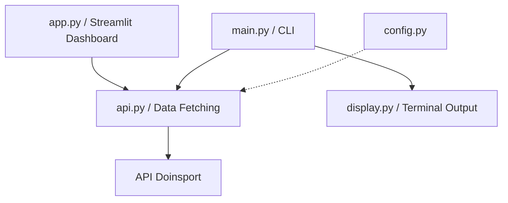
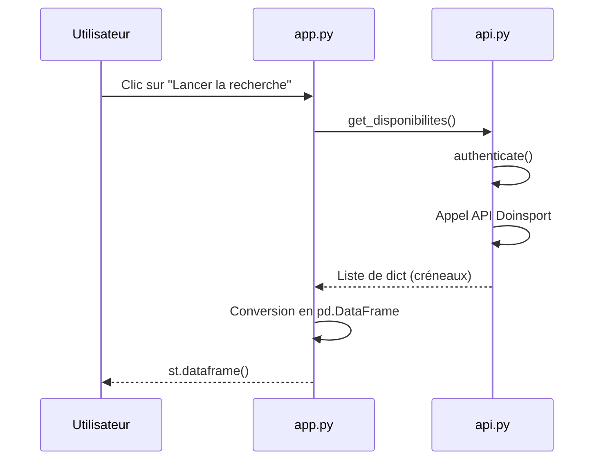

# 🛠️ HomeSmash - Documentation Technique

Ce document est destiné aux développeurs souhaitant comprendre le fonctionnement interne de l'application **HomeSmash**.

## 🏗️ Architecture Globale

L'application est structurée comme un module Python standard. Elle propose deux points d'entrée : une interface web développée avec **Streamlit** (`app.py`) et une interface en Command Line Interface (`main.py`).

### Vue d'ensemble logique

- **Couche présentation**
  - `app.py` : pages Streamlit (Accueil, Disponibilités, Réservations, Statistiques, Documentation).
  - `display.py` : rendu texte en console pour le mode CLI.

- **Couche métier / intégration**
  - `api.py` : encapsule tous les appels à l’API Doinsport (authentification, récupération des disponibilités, réservations, crédits).
  - `poll.py` : construit les payloads Google Chat (Cards / messages simples) et envoie les sondages / listes de réservations vers les webhooks.

- **Couche configuration**
  - `config.py` : centralise les identifiants Doinsport, les IDs de club/activité, les en-têtes HTTP et les URLs de webhooks Google Chat (prod + test).

### Architecture Streamlit (`app.py`)

- **Sidebar**
  - `st.radio` pour la navigation entre les pages, basé sur une liste fixe de libellés.
  - La page active est synchronisée dans `st.session_state["nav"]` pour permettre aux boutons de la page d’accueil de changer de page sans recréer les widgets.
  - `st.toggle("🧪 Mode Test (Salon privé)")` lit/écrit `st.session_state["test_mode"]` et pilote le choix du webhook :
    - `GOOGLE_CHAT_WEBHOOK_TEST` si `test_mode` est `True`,
    - `GOOGLE_CHAT_WEBHOOK` sinon.

- **Pages principales**
  - **Accueil** : callout crédits (via `get_credits()`), boutons d’accès rapide qui modifient `st.session_state["nav"]`.
  - **Disponibilités** : formulaire (semaine de départ, nombre de semaines) → `get_disponibilites()` → `DataFrame` avec colonnes métier + lien de réservation → bouton qui appelle `publie_dispo(..., webhook_url=current_webhook, credits_list=credits_list)`.
  - **Mes Réservations** : slider d’historique → `get_reservations()` → trois onglets (à venir / passées / annulées) → bouton qui appelle `publie_resa(..., webhook_url=current_webhook, credits_list=credits_list)`.
  - **Statistiques** : ouvre le Google Sheets d’historique.
  - **Documentation** : rend `README.md` (manuel utilisateur) et `readme_tech.md` (doc technique).

### Architecture CLI (`main.py` + `display.py`)

- `main.py` expose une CLI `python -m homesmash` avec les commandes :
  - `affiche_dispo` / `publie_dispo`,
  - `affiche_resa` / `publie_resa`,
  - et des options communes (`--semaine`, `--nb-semaines`, `--historique`).
- Ces commandes s’appuient sur les mêmes fonctions que l’UI Streamlit :
  - `get_disponibilites()` / `get_reservations()` dans `api.py`,
  - `affiche_dispo()` / `affiche_resa()` dans `display.py`,
  - `publie_dispo()` / `publie_resa()` dans `poll.py`.
- Le code métier est donc partagé, seul le canal de rendu change (console vs navigateur).

### Intégration Google Chat (`poll.py`)

- **Sondage de disponibilités**
  - `_construire_message_sondage()` génère une Card avec une ligne par créneau disponible, numérotée par emoji, plus une option “❌ Pas disponible” et une section “Mes crédits restants” éventuelle.
  - `publie_dispo()` choisit le webhook (paramètre ou valeur par défaut), récupère les dispos si besoin, construit la Card et la poste vers Google Chat.

- **Liste des réservations**
  - `publie_resa()` formate les réservations à venir / passées / annulées en sections distinctes.
  - Si aucune réservation n’est trouvée, un simple message texte `"📋 Aucune réservation trouvée."` est envoyé au webhook choisi.

---

## 📂 Détail des Fichiers

### 1. `config.py`
Contient tous les paramètres fixes et les secrets (identifiants, IDs de club).
> [!TIP]
> **Astuce Python** : Utiliser un fichier de config dédié évite de propager des chaines de caractères "en dur" (hardcoded) partout dans le code.

### 2. `api.py` (Le Cœur)
Gère toute la communication avec l'API Doinsport.
- `authenticate()` : Gère le login et récupère le JWT (Token).
- `get_disponibilites()` : Scanne les plannings des terrains.
- `get_reservations()` : Récupère l'historique et les futurs créneaux.
- `get_user_id()` : Récupère l'ID interne de l'utilisateur (nécessaire pour les réservations).

> [!IMPORTANT]
> **Vigilance** : L'API Doinsport attend des dates au format ISO-8601 en UTC. Le script se charge de convertir ces dates en heure locale (`Europe/Paris`) pour l'affichage.

### 3. `app.py` (Streamlit)
Interface web moderne et interactive.
- Organise les pages avec une sidebar (Accueil / Disponibilités / Réservations / Statistiques / Documentation).
- Construit des `DataFrame` avec Pandas pour afficher les retours de l'API de manière claire.
- Construit des URL de redirections (`Action`) permettant à l'utilisateur de cliquer pour réserver directement sur le site.

### 4. `display.py`
Responsable de la mise en page dans la console (quand utilisé en mode CLI).
- `affiche_dispo()` : Formate les résultats de recherche en tableaux ASCII.
- `affiche_resa()` : Utilise des tableaux formatés pour lister les réservations.

### 5. `main.py`
Point d'entrée CLI utilisant `argparse`. Il orchestre les appels en console.

---

## 🔄 Flux de fonctionnement (Exemple : Recherche de dispos Streamlit)

---

## 🚨 Points de vigilance

1. **Secrets** : Le fichier `config.py` contient des mots de passe. Dans un environnement de production réel, on utiliserait des variables d'environnement ou un Secret Manager.
2. **API Non-Officielle** : Nous utilisons l'API "web" de Doinsport. Si leur interface change, les endpoints (URLs) ou les formats JSON pourraient casser.
3. **Mode Test Google Chat** : le choix entre le salon Google Chat de production et celui de test est piloté uniquement par le **toggle “Mode Test (Salon privé)” dans la sidebar**. Aucune duplication de paramètre n’existe sur la page d’accueil, pour éviter les confusions.
4. **SSL Warnings** : `urllib3.disable_warnings` est utilisé car le script utilise `verify=False` pour les appels HTTPS (évite les problèmes de certificats locaux).
